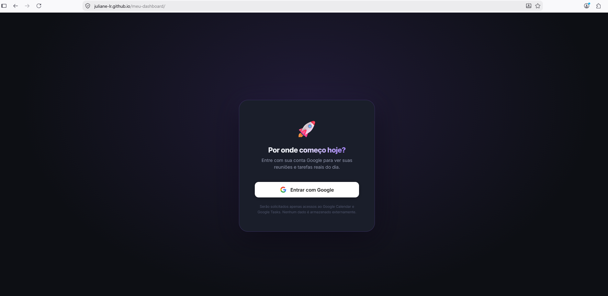
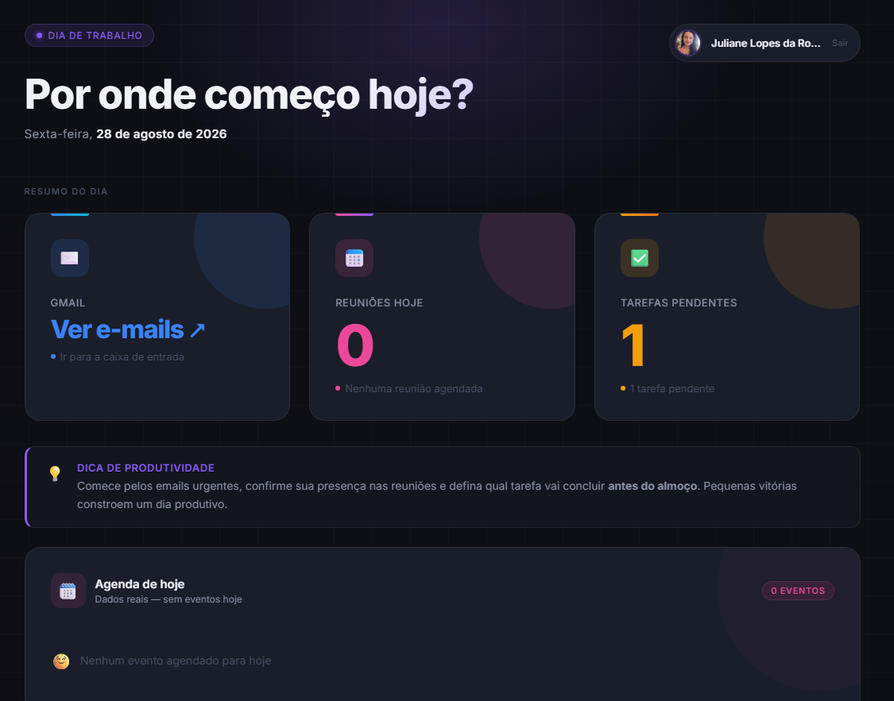
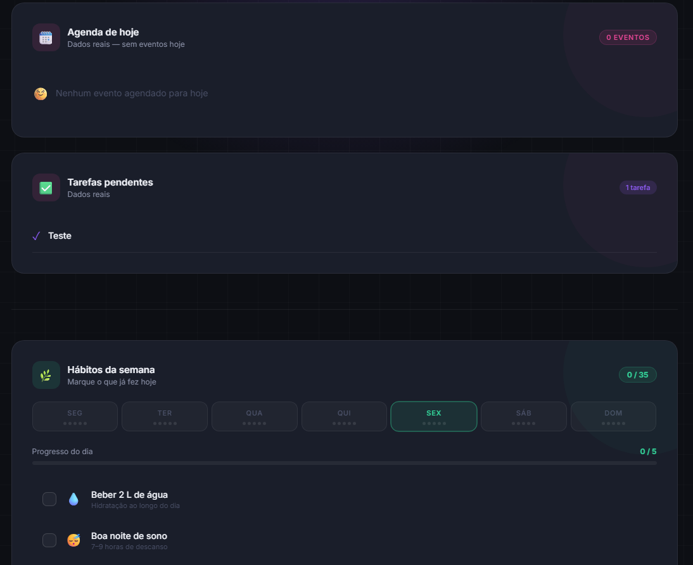

# 🚀 Por Onde Começo Hoje?

Dashboard pessoal desenvolvido para reunir, em uma única interface, informações úteis para organizar o início do dia.

A aplicação integra **Google Calendar e Google Tasks**, utiliza autenticação com a conta Google e apresenta reuniões e tarefas reais em um painel visual. Também inclui acompanhamento de hábitos e acesso rápido ao Gmail.

## 🎯 Objetivo

A proposta do projeto foi explorar o desenvolvimento de uma aplicação funcional utilizando **IA como copiloto**, partindo de uma necessidade cotidiana: reduzir a dispersão entre diferentes ferramentas e visualizar rapidamente o que precisa de atenção no dia.

O dashboard permite consultar compromissos e tarefas em uma única tela, além de reunir recursos complementares de organização pessoal.

## ✨ Funcionalidades

- autenticação com conta Google;
- consulta aos eventos do Google Calendar;
- exibição das reuniões agendadas para o dia;
- consulta às tarefas do Google Tasks;
- exibição das tarefas pendentes;
- acesso rápido à caixa de entrada do Gmail;
- resumo visual das informações do dia;
- acompanhamento semanal de hábitos;
- interface responsiva em formato de dashboard.

## 🔐 Integração com Google

A aplicação utiliza **OAuth 2.0** e serviços do Google para acessar, mediante autorização da pessoa usuária:

- **Google Calendar**, para consultar os compromissos do dia;
- **Google Tasks**, para consultar tarefas pendentes.

O card do **Gmail** funciona como um acesso rápido à caixa de entrada e não realiza a leitura das mensagens.

## 💡 Uma adaptação da proposta original

Durante o desenvolvimento, uma das funcionalidades propostas no exercício era apresentar a quantidade de e-mails não lidos.

Como esse indicador não seria particularmente útil para o meu uso pessoal, adaptei o card do Gmail para funcionar como um **atalho direto para a caixa de entrada**.

Essa alteração permitiu adequar o dashboard ao meu próprio contexto de uso, mantendo o foco nas informações que considero mais relevantes para organizar o dia.

## 🤖 Desenvolvimento assistido por IA

O projeto foi desenvolvido durante a **Sprint IA da PrograMaria**, em uma prática de **vibecoding**, utilizando o **Google Antigravity como copiloto de desenvolvimento**.

A experiência envolveu transformar requisitos e ideias de interface em uma aplicação funcional por meio de prompts, testes, avaliação dos resultados e ajustes iterativos.

O uso da IA fez parte da própria metodologia do projeto, com foco não apenas na geração de código, mas também na experimentação, análise das respostas produzidas e refinamento da solução.

## 🛠️ Tecnologias e recursos

- HTML5
- CSS3
- JavaScript
- Google Calendar API
- Google Tasks API
- OAuth 2.0
- Google Identity Services
- Git e GitHub
- GitHub Pages
- Google Antigravity

## 📸 Demonstração

### Autenticação com Google

A aplicação solicita autenticação para acessar os dados necessários do Calendar e Tasks.



### Visão geral

Após a autenticação, o dashboard apresenta um resumo das informações do dia.



### Tarefas e hábitos

As tarefas obtidas pelo Google Tasks são apresentadas junto aos recursos de organização pessoal do dashboard.



## 🌐 Acessar o projeto

O dashboard está publicado no GitHub Pages:

https://juliane-lr.github.io/meu-dashboard/

> Para consultar dados pessoais do Google Calendar e Google Tasks é necessário realizar a autenticação e autorizar os acessos solicitados pela aplicação.

## 📁 Estrutura do projeto

```text
meu-dashboard/
│
├── docs/
│   ├── login-google.png
│   ├── dashboard-visao-geral.png
│   └── dashboard-tarefas-habitos.png
│
├── index.html
└── README.md
```

## 📚 O que pratiquei

Durante o projeto, pratiquei conceitos relacionados a:

- integração de aplicações com APIs externas;
- autenticação OAuth 2.0;
- consumo e tratamento de dados vindos de serviços do Google;
- manipulação do DOM com JavaScript;
- construção de interfaces responsivas;
- adaptação de requisitos a uma necessidade real;
- desenvolvimento iterativo assistido por Inteligência Artificial;
- publicação de aplicações estáticas com GitHub Pages.

## 📌 Contexto

Projeto desenvolvido durante a **Sprint IA da PrograMaria**, como exercício prático de desenvolvimento assistido por Inteligência Artificial e vibecoding.

A aplicação foi construída com apoio do **Google Antigravity**, utilizado como copiloto durante o processo de desenvolvimento.
